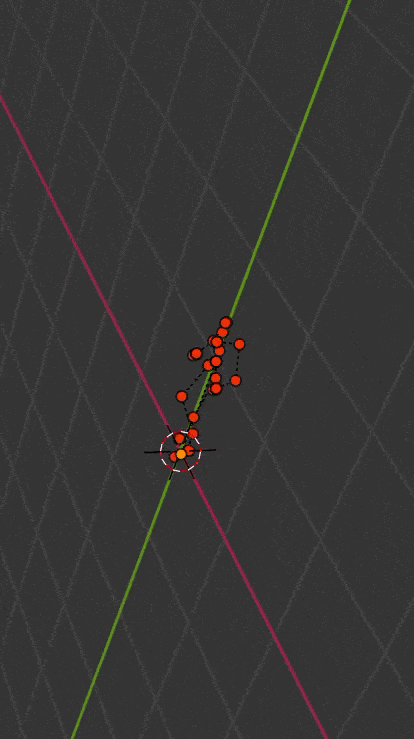

#  Phase-Functioned Neural Networks for Character Control

This is implementation of Phase-Functioned Neural Networks for Character Control for blender. 

## Running

1. Install numpy in blender python
2. Refer this link for more details on installing https://blog.michelanders.nl/2021/06/installing-python-packages-with-pip-in-your-blender-environment.html
3. Downlaod the whole Tensorflow folder from https://github.com/sebastianstarke/AI4Animation/tree/master/AI4Animation/SIGGRAPH_2017/TensorFlow
4. [path-to-blender] -P  animate_skeleton.py

## Results

References:

1. https://github.com/sebastianstarke/AI4Animation